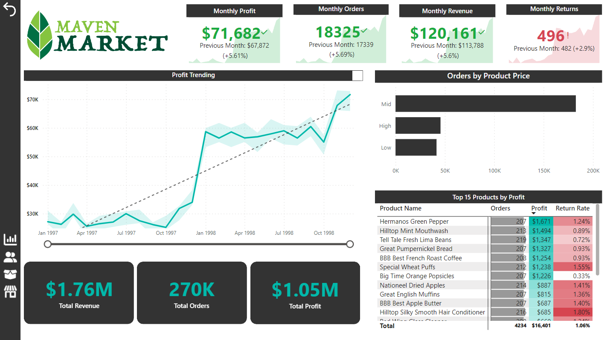

# Maven-Market-Report

## Introduction 
This is a Power BI project on the sales analysis of a store called 'Maven Market' (the dataset is sourced from Kaggle). 
The project is to analyze and derive insights to answer crucial questions and help the store make data-driven decisions.

## Problem statement

Problem statement:
1. Which store generates the most profit?
2. What is the monthly revenue, profit, orders and returns compared to the previous month?
3. What is the total revenue, total profit and profit margin?
4. Who is the best customer based on revenue?
5. From which region are the stores generating the most revenue?
6. What is the best product based on profit?

## Skills demonstrated:

The following Power BI features were incorporated:

- Bookmarking
- DAX
- Quick Measures
- Page Navigation
- Modelling 
- Filters
- Tooltips
- Buttons
- Parameters

## Modelling:

This schema organizes retail data, with Products, Customers, Stores and Calendar as primary entities.
Transactions Data and Return Data tables connect to these entities through foreign keys, establishing relationships for tracking product transactions and returns.

Products, Customers, Stores and Calendar tables have a one-to-many relationship with both Transactions Data and Return Data tables.

##Visualization:

The report comprises 4 pages:
1. Dashboard
2. Customer
3. Product
4. Stores

You can interact with the report [here](https://app.powerbi.com/groups/me/reports/c63c115c-8edf-4899-ac4b-9a4dd27cf513/ReportSection?experience=power-bi).
---

Features:
- In the top left is a button to clear all the filters applied to this page
- Under that button there is buttons to navigate through pages
- There is a slicer under the line chart that you can custumize to see the profits trending for a period you would like
- On the bar chart there is a feature that when you hover over a certian bar you will see key insights about the 
