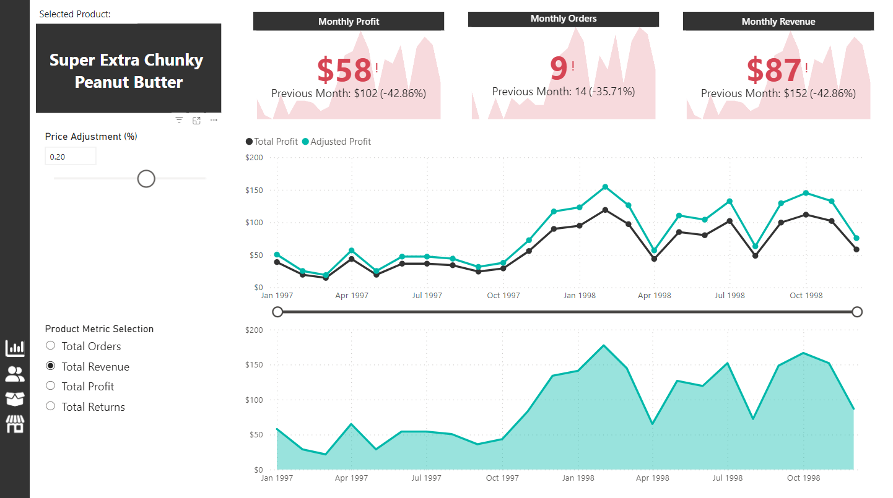

# Maven-Market-Report

## Introduction 
This is a Power BI project on the sales analysis of a store called 'Maven Market' (the dataset is sourced from Kaggle). 
The project is to analyze and derive insights to answer crucial questions and help the store make data-driven decisions.

## Problem statement

Problem statement:
1. Which store generates the most profit?
2. What is the monthly revenue, profit, orders and returns compared to the previous month?
3. What is the total revenue,profit and orders?
4. Who is the best customer based on revenue?
5. From which region are the stores generating the most revenue?
6. What is the best product based on profit?

## Applied skills for the project

The following Power BI features were incorporated:

- Bookmarking
- DAX
- Quick Measures
- Page Navigation
- Modelling 
- Filters
- Tooltips
- Buttons
- Parameters

## Modelling:

This schema organizes retail data, with Products, Customers, Stores and Calendar as primary entities.
Transactions Data and Return Data tables connect to these entities through foreign keys, establishing relationships for tracking product transactions and returns.

Products, Customers, Stores and Calendar tables have a one-to-many relationship with both Transactions Data and Return Data tables.

## Visualization:

The report comprises 4 pages:
1. Main
2. Customer
3. Product
4. Stores

You can interact with the report [here](https://app.powerbi.com/groups/me/reports/c63c115c-8edf-4899-ac4b-9a4dd27cf513/ReportSection?experience=power-bi).
---
## Main Page

Features:
- In the top left is a button to clear all the filters applied to this page.
- On the left, there are page navigation buttons.
- There is a slicer under the line chart that you can customize to see the profits trending for a period you would like.
- On the bar chart, there is a feature that, when you hover over a certain bar, you will see a custom tooltip with key performance metrics for the price range.
- In the top 15 product list, you can right-click on a product name, go to the drill-through and click on Product. This will navigate you to the product page, where you can gather key insights about that product.

## Customers Information Page

Features:
- In the top left is a button to clear all the filters applied to this page.
- On the left, there are page navigation buttons.
- There's a time filter above the Top Customer section. Use it to pick the timeframe and see who the top customer was during that period.

## Product Infromation Page

Features:
- On the left, there are page navigation buttons.
- Right-clicking and clicking on drill through Product on a product from the top 15 list takes users to this page for detailed product information. It's a quick way to see key metrics of the product you chose.
- The Price Adjustment feature enables users to slide prices in 10% increments, from -100% to +100%. It offers a swift and flexible method for adjusting product prices, providing insights into expected profits with each change.
- There is a Product Metrics Selection list that lets you click and choose from Total Orders, Total Profit, Total Revenue, and Total Returns for the selected product. It's a quick way to view key performance metrics.

## Stores Information Page

Features:
- In the top left is a button to clear all the filters applied to this page.
- On the left, there are page navigation buttons.
- On the bar chart, there is a feature that, when you hover over a certain bar, you will see a custom tooltip with key performance metrics for the stores by country.
- Clicking on a bar from the bar chart updates the page with information about the selected country.

## Conclusion

- The store generating the most profit is Store 13 in the USA, with $101,715 in profit.
- You'll find details on monthly revenue, profit, orders and returns compared to the previous month right at the top of the main page.
- Total Revenue: $1.76M, Total Orders: 270K and Total Profit: $1.05M.
- It's Ida Rodriguez with 290 orders and $2.24K in revenue.
- The USA is ranked from 1st to the 9th position by revenue.
- It's Hermanos Green Pepper with 207 orders that have generated $1,671 in profits.

